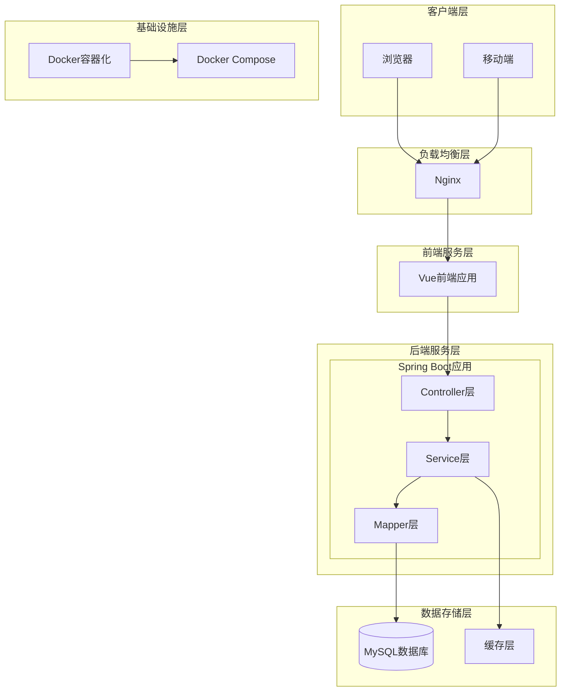

# 小说网站

一个前后端分离的小说阅读平台，提供用户阅读、小说管理和后台管理功能。

## 技术栈

### 后端
- Java 17
- Spring Boot 3.5.13
- MyBatis Plus 3.5.15
- MySQL 8.0

### 前端
- Vue 3.4+
- Vite 5.x
- Element Plus 2.x
- TypeScript

## 架构图

本项目采用前后端分离架构，整体架构如下图所示：



## 技术点

### 后端技术点
1. **分层架构**：严格遵循 Controller → Service → Mapper 三层架构，确保代码职责清晰
2. **统一响应封装**：使用 `Result<T>` 统一API响应格式，包含状态码、消息和数据
3. **参数校验**：Spring Validation + 自定义校验注解，确保输入数据合法性
4. **全局异常处理**：`@RestControllerAdvice` 统一异常处理，返回友好的错误信息
5. **事务管理**：Spring 声明式事务，`@Transactional` 注解控制事务边界
6. **MyBatis Plus增强**：使用 Lambda 查询，避免 SQL 字符串拼接，提高类型安全性
7. **安全防护**：密码 BCrypt 加密存储，防止 SQL 注入，敏感信息脱敏
8. **缓存优化**：Spring Cache + Caffeine 本地缓存，提升系统性能
9. **日志规范**：SLF4J + Logback，结构化日志输出，便于问题排查

### 前端技术点
1. **组件化开发**：Vue 3 Composition API，提高代码复用性和可维护性
2. **状态管理**：Pinia 状态管理，统一管理应用状态
3. **路由管理**：Vue Router 4，支持路由守卫和懒加载
4. **API 封装**：Axios 统一拦截器，处理请求/响应、错误处理和 loading 状态
5. **TypeScript 支持**：强类型检查，提高代码健壮性和开发体验
6. **UI 组件库**：Element Plus，提供丰富的UI组件和主题定制能力
7. **构建优化**：Vite 极速构建，支持按需导入和代码分割

### 部署运维
1. **Docker 容器化**：全栈容器化部署，环境一致性保障
2. **Docker Compose**：一键启动多服务，简化部署流程
3. **生产配置分离**：`application-prod.yml` 独立生产环境配置
4. **Nginx 反向代理**：前端静态资源服务 + 后端API代理
5. **数据库初始化**：自动创建数据库表和初始数据

### 架构特点
1. **前后端分离**：前后端独立开发、部署，通过 RESTful API 通信
2. **微服务就绪**：架构支持平滑扩展为微服务架构
3. **容器化部署**：支持快速部署到任何 Docker 环境
4. **配置外部化**：配置文件与环境分离，便于不同环境部署
5. **安全性考虑**：多层次安全防护，从输入校验到数据存储

## 项目结构

```
src/main/java/com/example/novel/
├── config/          # 配置类
├── controller/      # 控制器层
├── service/         # 服务层
├── mapper/          # 数据访问层
├── entity/          # 实体类
├── dto/             # 数据传输对象
├── vo/              # 视图对象
├── exception/       # 异常处理
└── NovelApplication.java
```

## 数据库配置

- 用户名：root
- 密码：123456
- 数据库：novel_db（需手动创建）

## 开发规范

请阅读项目根目录的 CLAUDE.md 文件，遵循其中的编码规范和开发流程。

## 运行方式

### 后端启动
```bash
mvn spring-boot:run
```

### 前端启动
```bash
cd novel-frontend
npm install
npm run dev
```

## Docker 容器化部署

项目已完全容器化，支持一键启动。

### 一键启动
```bash
docker-compose up -d
```

等待所有服务启动后，访问：
- 前端页面：http://localhost
- 后端 API：http://localhost:8080/api
- 后台登录：http://localhost/admin/login

### 服务说明
1. **MySQL**：端口 3306，数据库 `novel_db`，root 密码 `123456`
2. **后端**：端口 8080，使用生产环境配置（application-prod.yml）
3. **前端**：端口 80，Nginx 反向代理后端 API

### 初始化管理员账号
数据库初始化脚本已自动创建管理员账号：
- 用户名：`admin`
- 密码：`123456`

如需修改密码，可连接 MySQL 执行：
```sql
USE novel_db;
UPDATE user SET password = '$2a$10$...' WHERE username = 'admin';
```

### 停止服务
```bash
docker-compose down
```

### 查看日志
```bash
docker-compose logs -f
```

## 功能模块

1. **用户系统**：注册、登录、个人中心
2. **小说阅读**：分类浏览、小说列表、详情、章节阅读
3. **后台管理**：小说管理、章节管理、用户管理